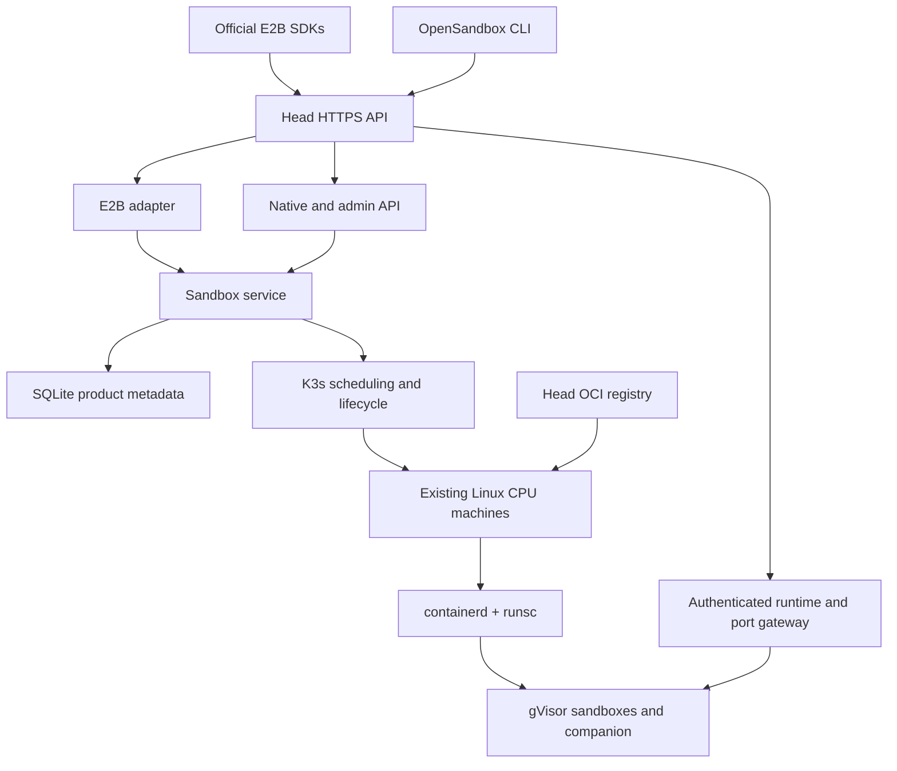

# Architecture

`opensandbox.e2b` owns protocol translation and SDK routing. `Service` owns
sandbox lifecycle and product metadata. `cluster.kube` owns Kubernetes REST and
loopback port forwarding. The Go companion owns commands, process groups, PTYs
and files inside each gVisor sandbox. Kubernetes owns placement and resource
accounting; there is no second scheduler.

The head runs a systemd API service, K3s server and authenticated TLS registry.
Workers run K3s agent, containerd and runsc. SSH is used for installation and
administrative operations only. A dedicated head receives no verified sandbox
label, so RuntimeClass scheduling excludes it. A single-node head may receive
that label and run workloads.

Sandboxes are Jobs with one pod, no retries and an adjustable deadline. Job
failure policy prevents replacing disrupted sandboxes. The head marks failed
workers' sandboxes lost and deletes their Jobs. The companion also enforces
expiry. API restarts reconcile existing workloads and retain background commands.

Product metadata, identities, key hashes, templates, audit entries and counters
are persisted behind the `Store` abstraction. Kubernetes is authoritative for
workload state and capacity. A database migration is required before swapping
SQLite for another backend; PostgreSQL is not implemented in this release.

The companion is compiled for amd64 and arm64 and published as a multiarch OCI
image. An init container copies it into a read-only shared volume in the user
image. User containers run this companion as PID 1. Images do not need a custom
base image; E2B command shells require bash. Builders use a separate namespace
and temporary registry pull capabilities; the head publishes the output archive.

Cilium supplies networking and explicit deny rules for host/cluster traffic.
This closes the node-traffic exception in ordinary Kubernetes NetworkPolicy.
The gateway authenticates SDK runtime headers or parses the wildcard application
hostname, then uses a Kubernetes port forward to sandbox loopback. HTTP and
WebSocket requests therefore never expose worker IPs.

See [instructions](../instructions.md) for installation, failure semantics and
operational limits. Real Linux acceptance is distinct from local protocol tests.
